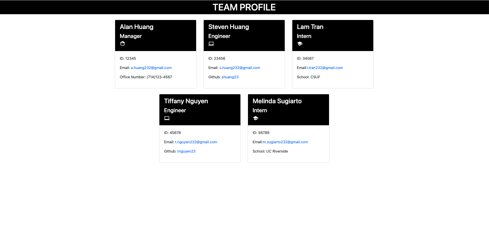

# C10_Team_Generator

  ## Table-of-Contents
  * [Description](#description)
  * [Installation](#installation)
  * [Usage](#usage)
  * [Contributing](#contributing)
  * [Tests](#tests)
  * [Questions](#questions)
  * [Sample](#sample)
  * [Links](#links)
 
  ## Description
    Following the prompts, the Team Generator will generate a Team Members HTML file to display information provided by the user. 

  ## Installation
  Download the required files into a local directory and run index.js

  ## Usage
  Follow the given prompts in the terminal. At the end of the prompts, an index.html will be created in the "dist" folder with the provided information

  ## Contributing
  Currently, I am not accepting contributors for this project

  ## Tests
  There are 4 unit tests included in this application. Use command "npm run test".

  ## Questions
  For any questions, please reach out to me at the following:
  - GitHub: https://github.com/ahuang23
  - Email: a.huang232@gmail.com

  ## Sample
  

  ## Links
  [GitHub](https://github.com/ahuang23/C09_ReadMe_Generator)
  [Tutorial](https://watch.screencastify.com/v/8507WzI8fZsDTxJJF6UB)

